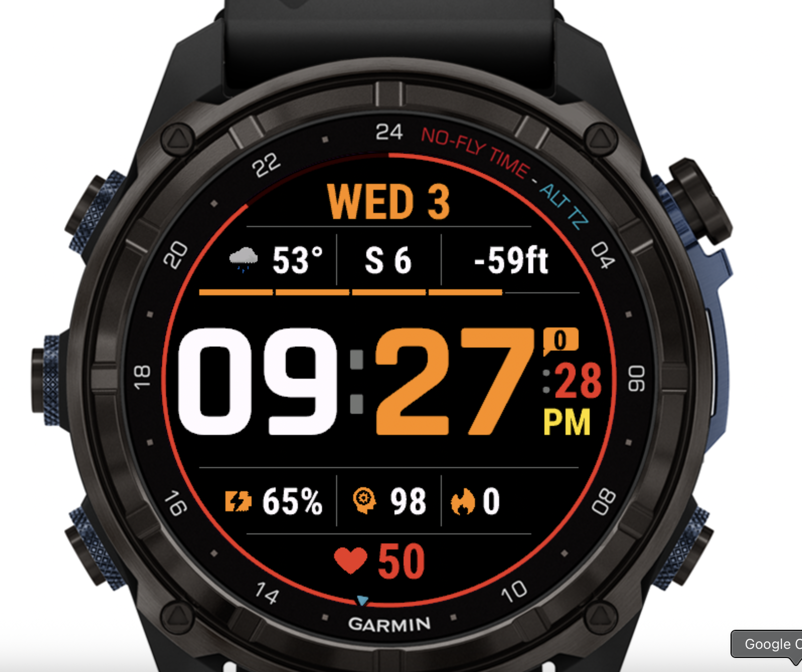
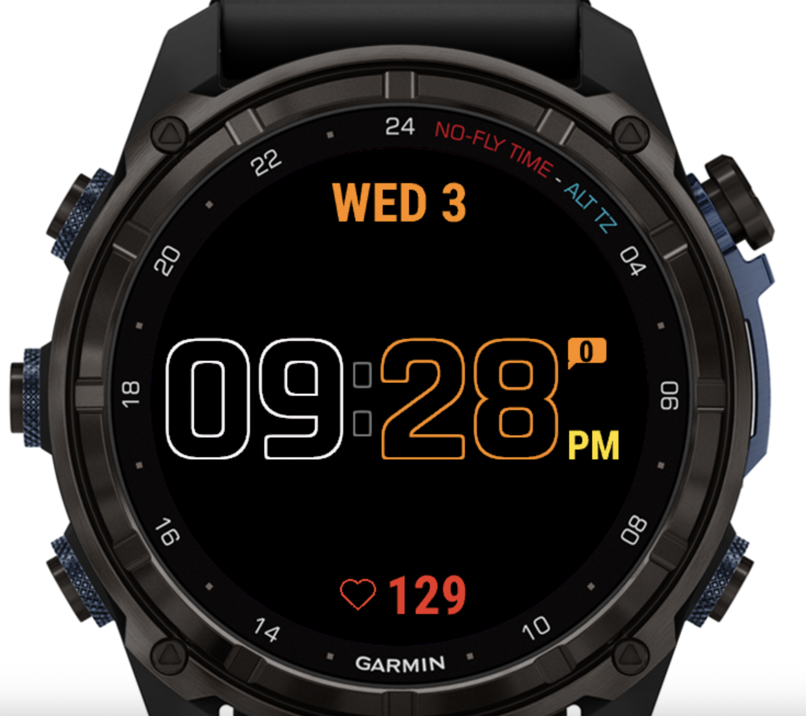
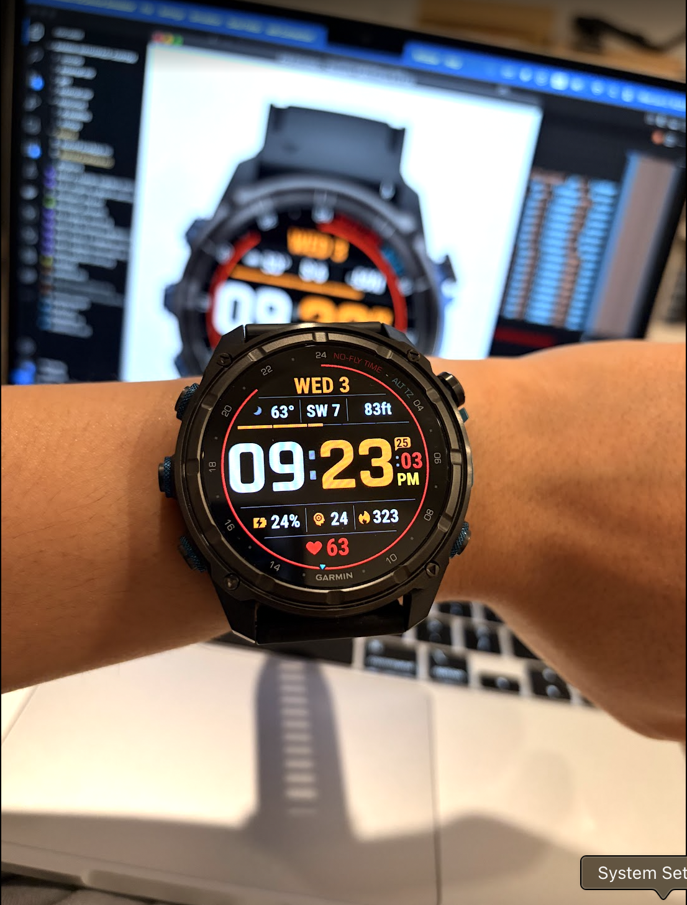

# Mk3i51 Tactical Diver

A custom Garmin Connect IQ watch face for the **Descent Mk3i 51mm** (454×454px AMOLED). Built from scratch with a tactical aesthetic: bold time, dive-computer NFT arc, weather, and a full Always-On Display mode.

---

## Demo

| High Power | Always-On Display (AOD) | On Wrist |
|:---:|:---:|:---:|
|  |  |  |

---

## Features

- **210px vector time** — BionicBold (falls back to `FONT_NUMBER_HOT`), white hours + orange minutes
- **NFT outer arc** — No-Fly Time complication as a red clockwise arc at the screen edge; only drawn when a real dive has occurred (no fake arc when NFT data is unavailable)
- **Alt-TZ triangle** — small blue triangle on the arc ring pointing to Taipei time (UTC+8), drawn from raw UTC epoch so it's immune to `timeZoneOffset` quirks
- **5-segment battery bar** — sits on the grid line above the time zone, color-coded: orange > 30%, yellow > 15%, red ≤ 15%
- **Info row** — weather icon + temperature (°F) | wind direction + speed (knots) | altitude (ft)
- **Data row** — Body Battery % | Stress | Calories
- **Bottom row** — heart rate with filled heart icon (high power) or outline heart icon (AOD)
- **Right column** — notification bubble + AM/PM label + live seconds
- **Always-On Display** — date + outline time digits + notification count + AM/PM + heart rate; minimal pixel count for AMOLED burn-in budget
- **Symmetric grid** — every horizontal and vertical rule is derived from a single center point; top mirrors bottom exactly

---

## Project Structure

```
garmin-watchface-custom/
├── manifest.xml                  # app ID, permissions, target device
├── monkey.jungle                 # build config (source + resource paths)
├── source/
│   ├── WatchFaceApp.mc           # AppBase entry point
│   └── WatchFaceView.mc          # all drawing logic
├── resources/
│   ├── drawables/
│   │   ├── drawables.xml         # bitmap resource declarations
│   │   ├── launcher_icon.png
│   │   ├── heartrate_icon.png    # filled wide heart (high power)
│   │   ├── heartrate_aod_icon.png# stroke outline heart (AOD)
│   │   ├── bodybattery_icon.png
│   │   ├── calories_icon.png
│   │   ├── stress_icon.png
│   │   └── weather_icons/        # PNG set from mikeller/garmin-divesite-weather-widget
│   └── strings/
│       └── strings.xml           # AppName
├── demo_high_power.png
├── demo_always_on.png
└── Mk3i51TacticalDiver.prg       # compiled sideload binary
```

---

## Build & Deploy

### Prerequisites

- [Garmin Connect IQ SDK](https://developer.garmin.com/connect-iq/sdk/) with `monkeyc` on your PATH
- A developer key (generate once: `monkeydo keygen developer_key`)
- VS Code + [Monkey C extension](https://marketplace.visualstudio.com/items?itemName=garmin.monkey-c) (optional but recommended)

### Compile

```bash
monkeyc \
  -f monkey.jungle \
  -o Mk3i51TacticalDiver.prg \
  -y developer_key.der \
  -d descentmk351mm \
  -r
```

The `-r` flag builds a release (non-debug) binary.

### Sideload to watch

1. On the watch: **Settings → System → USB Mode → MTP**
2. Connect USB cable; open [OpenMTP](https://openmtp.ganeshrvel.com/) (Mac) or Windows Explorer
3. Copy `Mk3i51TacticalDiver.prg` to `GARMIN/APPS/` on the watch
4. Disconnect; on watch go to **Watch Faces** and select it

> The watch face will show a small developer key icon in some firmware versions — this is normal for sideloaded apps.

---

## Icon Sources

All icons are SVGs from [SVG Repo](https://www.svgrepo.com/), converted to PNG with `cairosvg`:

| File | SVG Repo URL | Used for |
|---|---|---|
| `heartrate_icon.png` | https://www.svgrepo.com/svg/333996/heart | Filled wide heart, high power |
| `heartrate_aod_icon.png` | https://www.svgrepo.com/svg/364584/heart-straight-fill | Stroke outline heart, AOD |
| `bodybattery_icon.png` | https://www.svgrepo.com/svg/535209/battery-charge | Body Battery data slot |
| `stress_icon.png` | https://www.svgrepo.com/svg/483671/brain-engine | Stress data slot |
| `calories_icon.png` | https://www.svgrepo.com/svg/525884/fire | Calories data slot |

### Converting SVG → PNG

```bash
# Install: pip install cairosvg
cairosvg input.svg -o output.png -W 33 -H 33
```

To recolor (e.g., red heart on black):

```bash
# sed-replace the stroke/fill color, then convert
sed 's/#000000/#EB3324/g' heart.svg | cairosvg - -o heartrate_icon.png -W 33 -H 33
```

Garmin bitmaps are loaded at draw time via `Application.loadResource(Rez.Drawables.Id)` — you cannot tint them programmatically, so bake the color into the PNG.

### Weather icons

From [mikeller/garmin-divesite-weather-widget](https://github.com/mikeller/garmin-divesite-weather-widget) (MIT). Mapped to `Weather.getCurrentConditions().condition` integer codes in `_drawWeatherIcon()`.

---

## Layout Design

The screen is 454×454 px. Every constant is derived from a single center point (227, 227) so the layout is perfectly symmetric — top mirrors bottom.

```
y=48   [            WED 3            ]  ← date, FONT_MEDIUM, orange
y=74   ─────────────── (w=282) ──────────────
       [ ☁ 53° ] │ [  S 6  ] │ [-59ft]    ← info row, y=107
├── vlines x=175, 279: y=82→132 ─────────────────────────────┤
y=140  ▓▓▓▓▓▓▓▓▓▓▓▓▓ BATTERY (5 segs) ▓▓▓▓▓▓▓▓▓▓▓▓▓

       [  09  :  27  ]   [🔔]          ← time 210px, center y=227
                          [:28]
                          [ PM ]

y=314  ▒▒▒▒▒▒▒▒▒▒▒▒▒ grid line ▒▒▒▒▒▒▒▒▒▒▒▒▒
├── vlines x=175, 279: y=322→372 ─────────────────────────────┤
       [ 🔋 65% ] │ [🧠 98] │ [🔥 0  ]  ← data row, y=347
y=380  ─────────────── (w=282) ──────────────
y=406           [♥  50  ]               ← heart rate, FONT_MEDIUM

[  NFT arc — red clockwise from 12 o'clock, r=224  ]
[  Alt TZ triangle — blue, at Taipei time position  ]
```

Key constants in `WatchFaceView.mc`:

```monkeyc
const SCR_CX = 227;   const SCR_CY = 227;
const DATE_Y  = 48;   const BOT_Y   = 406;   // 48+406=454 ✓
const LINE1_Y = 74;   const LINE5_Y = 380;   // 74+380=454 ✓
const INFO_Y  = 107;  const DATA_Y  = 347;   // symmetric ✓
const LINE3_Y = 140;  const LINE4_Y = 314;   // 140+314=454 ✓
const TIME_Y  = 227;  // dead center

// Right column — hardcoded so they never shift when font size changes
const SEC_X      = 405;
const SEC_MSG_Y  = 186;
const SEC_AMPM_Y = 266;
const SEC_Y      = 226;
```

> **Lesson learned**: derive positions from named constants, never from `getFontHeight()` — font metrics can shift slightly between builds and will silently move everything that depends on them.

---

## Data Sources

| Field | Toybox API |
|---|---|
| Time + Date | `System.getClockTime()` / `Gregorian.info(Time.now(), ...)` |
| Temperature (°F) | `Weather.getCurrentConditions().temperature` (°C → °F converted) |
| Wind | `getCurrentConditions().windSpeed` (m/s → knots) + `.windBearing` (→ compass string) |
| Altitude (ft) | `Activity.getActivityInfo().altitude` (m → ft) |
| Battery % | `System.getSystemStats().battery` |
| Heart Rate | `Complications.COMPLICATION_TYPE_HEART_RATE` |
| Calories | `Complications.COMPLICATION_TYPE_CALORIES` |
| Body Battery | `Complications.COMPLICATION_TYPE_BODY_BATTERY` |
| Stress | `Complications.COMPLICATION_TYPE_STRESS` |
| No-Fly Time | `Complications.COMPLICATION_TYPE_NO_FLY_TIME` (dive devices only) |
| Notifications | `System.getDeviceSettings().notificationCount` |

### Complications pattern

Register once in `onShow()`, unregister in `onHide()`. Read cached values in `_refreshComplications()` called at the top of every `onUpdate`:

```monkeyc
function onShow() as Void {
    Complications.registerComplicationChangeCallback(method(:onComplicationChange));
    Complications.subscribeToUpdates(_hrId);
    // ... repeat for each Id
}

function onComplicationChange(id as Complications.Id) as Void {
    _refreshComplications();
    WatchUi.requestUpdate();
}

private function _cv(id) {
    if (id == null) { return null; }
    var c = Complications.getComplication(id);
    return c != null ? c.value : null;
}
```

Always null-guard every complication value before displaying it.

---

## Always-On Display (AOD)

AMOLED watches support AOD — a low-power mode that updates once per minute. The Garmin Connect IQ API for this is:

- `onEnterSleep()` — called when the wrist drops; transition to AOD
- `onExitSleep()` — called when the wrist raises; return to high power
- `onPartialUpdate(dc)` — called ~once per minute during AOD for the tick update

### Reliable AOD pattern

The key insight is that `onPartialUpdate` alone is unreliable in the simulator, and calling `WatchUi.requestUpdate()` from `onEnterSleep` triggers `onUpdate` which would draw the full high-power face. The bulletproof solution:

```monkeyc
private var _isAsleep as Boolean = false;

function onEnterSleep() as Void {
    _isAsleep = true;
    WatchUi.requestUpdate();        // triggers onUpdate with _isAsleep=true
}

function onExitSleep() as Void {
    _isAsleep = false;
    WatchUi.requestUpdate();        // triggers full face redraw
}

function onPartialUpdate(dc as Graphics.Dc) as Void {
    _isAsleep = true;               // re-affirm in case of missed onEnterSleep
    onUpdate(dc);
}

function onUpdate(dc as Graphics.Dc) as Void {
    dc.setColor(C_BG, C_BG);
    dc.clear();
    if (_isAsleep) {
        _drawDate(dc);
        _drawTimeSleep(dc);         // outline digits, no seconds
        _drawBottomRowAod(dc);      // outline heart icon + solid HR digit
        return;
    }
    // full high-power face...
}
```

### AOD pixel budget

Garmin enforces a ~10% lit-pixel budget on AMOLED in AOD mode. To stay within it:
- Clear the entire screen to black (`C_BG = 0x000000`)
- Draw only the essentials: date, time, heart rate
- Use outline (hollow) text for the large time digits — they light only the stroke pixels, not the filled interior
- System-level pixel shifting handles burn-in; you do not need to animate position yourself

---

## Outline Text Technique

For AOD, the large time digits are drawn hollow (outline only) to reduce lit pixels. There is no native "outline font" in Connect IQ, so it's simulated by over-drawing:

```monkeyc
private function _drawOutlineText(dc, x, y, font, text, justify, color) as Void {
    var t  = 2;           // stroke thickness in pixels
    var px = x - t;       // shift left so rightmost offset stays at original boundary
    var dxArr = [-t, 0, t, -t, t, -t, 0, t];
    var dyArr = [-t, -t, -t,  0, 0,  t, t, t];

    // 1. Draw text at 8 offsets (cardinal + diagonal) in stroke color
    dc.setColor(color, Graphics.COLOR_TRANSPARENT);
    for (var i = 0; i < 8; i++) {
        dc.drawText(px + dxArr[i], y + dyArr[i], font, text, justify);
    }

    // 2. Punch out the center with background color to hollow the digit
    dc.setColor(C_BG, Graphics.COLOR_TRANSPARENT);
    dc.drawText(px, y, font, text, justify);
}
```

The `px = x - t` shift keeps the glyph's right edge at the original pixel position — without it, the rightmost offset would expand the bounding box and shift everything right.

This technique works for any font size. The trade-off: drawing the same string 9× per digit, which is fine for a once-per-minute AOD update.

---

## NFT Arc

The No-Fly Time arc is the outer ring. It reads directly from the `COMPLICATION_TYPE_NO_FLY_TIME` complication (minutes remaining). The arc only appears when real dive data exists — there is no fallback to time-of-day or any other value:

```monkeyc
private function _drawNftArc(dc as Graphics.Dc) as Void {
    dc.setPenWidth(NFT_PEN);
    dc.setColor(C_NFT_TRK, Graphics.COLOR_TRANSPARENT);
    dc.drawCircle(SCR_CX, SCR_CY, NFT_R);   // dim track ring always visible

    var hours = 0.0;
    if (_nftMinutes != null && _nftMinutes > 0) {
        hours = _nftMinutes / 60.0;
        if (hours > 24.0) { hours = 24.0; }
    }
    if (hours > 0.0) {
        var sweep = (hours / 24.0 * 360.0).toNumber();
        // Black border pass first (wider pen), then colored arc on top
        dc.setPenWidth(NFT_PEN + 10);
        dc.setColor(C_BG, Graphics.COLOR_TRANSPARENT);
        dc.drawArc(SCR_CX, SCR_CY, NFT_R, Graphics.ARC_CLOCKWISE, 90, 90 - sweep);
        dc.setPenWidth(NFT_PEN);
        dc.setColor(C_NFT_ARC, Graphics.COLOR_TRANSPARENT);
        dc.drawArc(SCR_CX, SCR_CY, NFT_R, Graphics.ARC_CLOCKWISE, 90, 90 - sweep);
    }
}
```

Arc angle mapping: 12 o'clock = 90°, clockwise, 24 h = full 360°. `Graphics.ARC_CLOCKWISE` with start=90, end=90-sweep gives the correct direction.

---

## Alt-TZ Triangle

A small blue triangle points to the current Taipei time (UTC+8) on the arc ring — like a second time-zone hand on an analog watch bezel. It avoids `getDeviceSettings().timeZoneOffset` (unreliable across DST changes) and instead computes from raw UTC epoch:

```monkeyc
var utcSec    = Time.now().value();               // seconds since epoch
var secOfDay  = (utcSec % 86400).toNumber();
var taipeiMins = (secOfDay / 60 + 480) % 1440;   // UTC+8 = +480 min
var taipeiH   = taipeiMins.toFloat() / 60.0;      // 0.0–24.0
var angleDeg  = 90.0 - (taipeiH / 24.0 * 360.0); // 90° = midnight at top
```

To adapt for a different timezone, change `+ 480` to your UTC offset in minutes.

---

## Color Palette

| Constant | Hex | Used for |
|---|---|---|
| `C_BG` | `#000000` | background, outline punch-out |
| `C_WHITE` | `#FFFFFF` | hour digits, weather text |
| `C_ORANGE` | `#FF8C00` | minute digits, date, battery icon, notification bubble |
| `C_YELLOW` | `#FFDD00` | AM/PM label |
| `C_DIM` | `#777777` | grid lines, colon, seconds colon |
| `C_NFT_ARC` | `#EB3324` | NFT arc, seconds digits, heart rate value |
| `C_NFT_TRK` | `#2A0000` | dim arc track ring |
| `C_BATT_HI` | `#FF8C00` | battery bar > 30% |
| `C_BATT_MID` | `#FFDD00` | battery bar 15–30% |
| `C_BATT_LOW` | `#FF2200` | battery bar ≤ 15% |

---

## Vector Font

The large time uses a vector font loaded at layout time:

```monkeyc
function onLayout(dc as Graphics.Dc) as Void {
    _timeFont = null;
    if (!(Graphics has :getVectorFont)) { return; }
    _timeFont = Graphics.getVectorFont(
        {:face => ["BionicBold", "RobotoCondensedBold"], :size => 210});
}
```

`getVectorFont` takes a priority list — it uses BionicBold if available on the device, otherwise RobotoCondensedBold. Always check `Graphics has :getVectorFont` before calling it (older SDK versions don't have it), and fall back to `Graphics.FONT_NUMBER_HOT` so the face renders on all firmware versions.

The size (210) is the cap-height in pixels. At 454px screen width, two two-digit numbers plus a colon fills the face edge-to-edge.

---

## Adapting for Another Watch Face

1. **Change the target device** in `manifest.xml` (`<iq:product id="..."/>`). Screen dimensions and supported API levels differ per device — check the [Connect IQ Device Registry](https://developer.garmin.com/connect-iq/compatible-devices/).

2. **Update layout constants** in `WatchFaceView.mc`. Set `SCR_CX`/`SCR_CY` to half your screen dimensions, then derive all other positions symmetrically from center.

3. **Adjust vector font size**. At 390px wide (Fenix 7), size ~180 fits comfortably. Use `dc.getTextWidthInPixels(str, font)` to measure before committing to a size.

4. **Drop complications you don't need**. Each `subscribeToUpdates` call costs a small subscription overhead. Only subscribe to what you display.

5. **AOD is opt-in per device**. Check your target device's spec — not all Garmin devices support `onPartialUpdate`. The `_isAsleep` flag pattern works on any device; `onPartialUpdate` is just a bonus tick.

6. **Icons**: Convert SVGs to PNG at the exact pixel size you intend to draw them. Garmin will stretch bitmaps if dimensions don't match, which looks bad on AMOLED. Use `cairosvg` with explicit `-W`/`-H` flags.

---

## Resources

- [Garmin Connect IQ Developer Docs](https://developer.garmin.com/connect-iq/overview/)
- [Connect IQ API Reference](https://developer.garmin.com/connect-iq/api-docs/)
- [awesome-garmin](https://github.com/bombsimon/awesome-garmin) — open-source watch faces & widgets
- [mikeller/garmin-divesite-weather-widget](https://github.com/mikeller/garmin-divesite-weather-widget) — weather icon PNG set (MIT)
- [SVG Repo](https://www.svgrepo.com/) — icon sources
